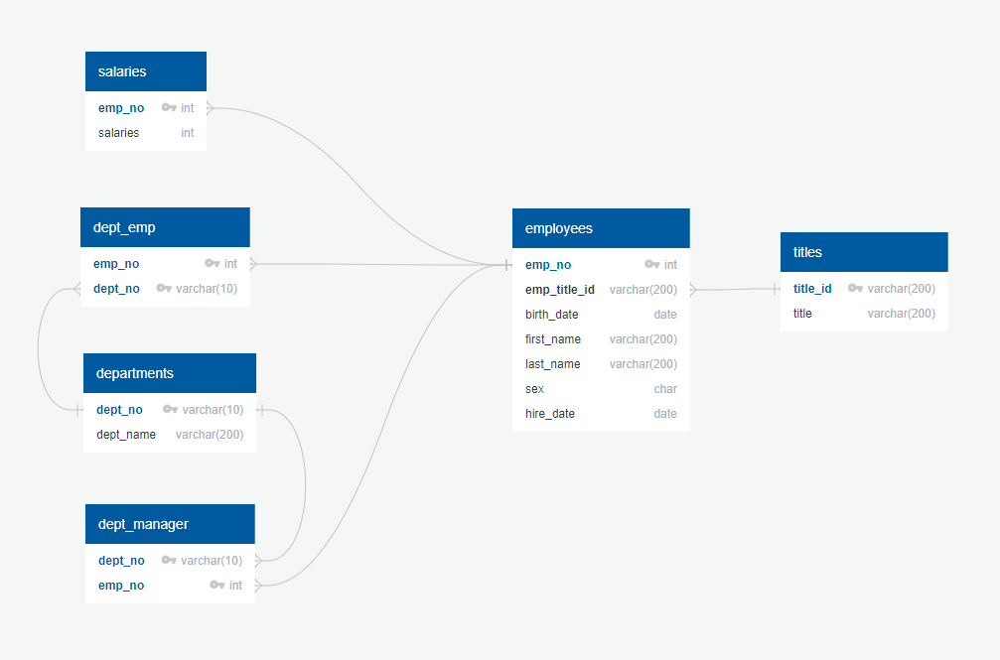
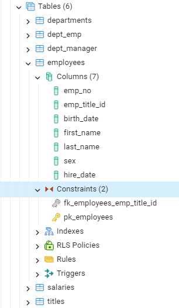

# Module 9 Challenge - Data Modeling, Data Engineering & Data Analysis
## Background
It’s been two weeks since you were hired as a new data engineer at Pewlett Hackard (a fictional company). Your first major task is to do a research project about people whom the company employed during the 1980s and 1990s. All that remains of the employee database from that period are six CSV files.

For this challenge, you’ll design the tables to hold the data from the CSV files, import the CSV files into a SQL database, and then answer questions about the data. That is, you’ll perform data modeling, data engineering, and data analysis, respectively.

## Challenge Instructions
This Challenge is divided into three parts: data modeling, data engineering, and data analysis.

### Data Modeling
-  Inspect the CSV files, and then sketch an Entity Relationship Diagram of the tables. 

### Data Engineering
- Use the provided information to create a table schema for each of the six CSV files. 
   - Specify the data types, primary keys, foreign keys, and other constraints.
   - For the primary keys, verify that the column is unique. Otherwise, create a composite keyLinks to an external site., which takes two primary keys to uniquely identify a row.
   - Create the tables in the correct order to handle the foreign keys.
- Import each CSV file into its corresponding SQL table.
- To avoid errors, import the data in the same order as the corresponding tables got created. And, remember to account for the headers when doing the imports.

### Data Analysis
1. List the employee number, last name, first name, sex, and salary of each employee.

2. List the first name, last name, and hire date for the employees who were hired in 1986.

3. List the manager of each department along with their department number, department name, employee number, last name, and first name.

4. List the department number for each employee along with that employee’s employee number, last name, first name, and department name.

5. List first name, last name, and sex of each employee whose first name is Hercules and whose last name begins with the letter B.

6. List each employee in the Sales department, including their employee number, last name, and first name.

7. List each employee in the Sales and Development departments, including their employee number, last name, first name, and department name.

8. List the frequency counts, in descending order, of all the employee last names (that is, how many employees share each last name).

## Challenge Solutions
The solution for this challenge is under the EmployeeSQL/output_data folder. The input CSV's are located under EmployeeSQL/data folder.

### Data Modeling
-  Below ERD is created using <a href="https://www.quickdatabasediagrams.com/" target="_blank">QuickDBD</a>. 
- This illustrates relationship between six dataset provided.
- The ERD is located under "EmployeeSQL/output_data folder/Entity-Relationship-Diagram-Employess.png".

### Data Engineering
- Based on the ERD created above, to create schemas follow the below steps:
   - Launch Postgres app.
   - Select/Create a database where the schema needs to be created.
   - Open schema creation SQL file located under "EmployeeSQL/output_data folder/schema-creation-sql.sql".
   - Click on Run, that will run all the schema and constraints creation.

### Data Analysis
- Queries for all the above 8 problem statements for data analysis can be found under "EmployeeSQL/output_data folder/Data_Analysis_Queries.sql"
- Select one query at a time and click on Run to see the output.

